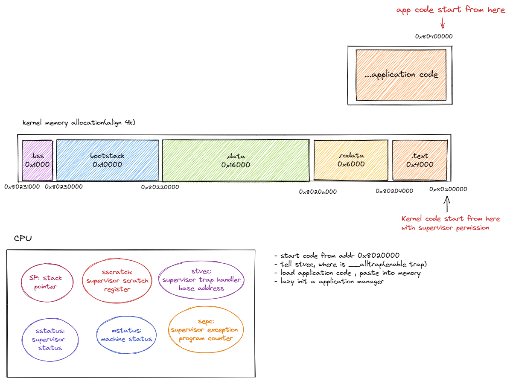

Environment: Ubuntu 22.04 LTS linux 5.15.0 there is no Chinese input method.

Protocol:
1. Why? is I don't understand, will back to this line later.

## 11-20

since last time , os1 & os2 both facing build failure.
I decide, write this stuff from scratch, wether is copy from other source || write it by my self.

and , I need write down the specific detail why this struct need to be write in this way.
it can push me to think about why.

and try to comment each line of code.

## 11-21 23:00 kinda lazy today.

if you want us logging in batch, under main.rs , you need spcific crate log with extern.(instead of use log::*;

## 11-23 22:25 how to do trap

when do trap, there are several steps need to be done:
1. trap mode from Supervisor to User, implement trap.
   in rust , how to capture the trap? we need match mcause or scause , and then handle the exception.
2. save kernel context
3. swithc to user space , and user stack
4. point pc to the application start address

## 11-29 22:07 commoent trap.S

today's target is just make this appliction run once it's able to be print.  

we now have trap.S make sure we can switch supervisor mode & user mode.  

once saving done, we need let cpu point to application code, and do syscalls.  

when kernel want to call a new appliction, cpu pc register will point to the application. and run command one by one.  

once cpu get a trap singal, it will trigger a interrupt singal. kernel need to handle such singal, dispatch the event, write down the handler function.  

but , how to handle a trap event?  

first, we need know , where the trap code is, so, we need setup trap vec for risc v, which is , let the stvec(supervisor trap vector base address register) point to traphandler, in our code, is __alltraps.  
but before handle traps, we need to save the application stack(need to build one?), and other register values. to kernel stack.  
once it's done , we can switch to kernel stack, and with high privilege cpu call. to invoke syscall function(which is , syswrite, sysread, etc...)

upon , we have described how to make a trap handler. which make kernel able to handler traps when application need to use syscalls.  

next step, let's setting up applications.  

rcore using batch.rs to call __restore, and load init applications. first one is just directly point to ADDRESS: 0x80400000  

## 11-30 17:12 Run applications

today's target is to get the application run.  

run\_next\_app() makes kernel enter into User mode.  

the trick is using trap.S __restore assembly code.  

the question is , how trap.S enter into user mode?  

## 12-02 10:58 run 过程当中load app 不正常，总是 trap 到 IllegalInstruction

don't know why  
1. application 本身存在问题
2. load application  存在问题。

复制了 os2 的 load app，同样的问题。  

basictly the reason is CI implementation do a lot of stuff for us. and if we run `make test2`, it will works. do not know the reason yet.  

## 12-04 23:28  let's try chapter3 with timer & multiple applications

target:  
- we need load application at once , instead of load it at 0x80400000
  - first we need consider re-write the code, because there is no need to load application with appmanager;  
- implement time traper.

# Open-Source OS Training Comp 2022

Welcome to Open-Source OS Training Comp 2022（2022年开源操作系统训练营）.
## Scheduling
- NOTICE current [**SCHEDULING**](./scheduling.md)（2022年开源操作系统训练营的计划安排）!
- [News](./news.md)（2022年开源操作系统训练营的新闻和纪要）
- [QA](./QA.md)（常见问题解答）
- [Online Ranking](https://os2edu.cn/grading/)（训练营在线排行榜）
## History
- [open-source  os training comp 2021](https://github.com/rcore-os/rCore/wiki/os-tutorial-summer-of-code-2021)
- [open-source  os training  comp 2020](https://github.com/rcore-os/rCore/wiki/os-tutorial-summer-of-code-2020)

## Guide & Lab Test for Rust
- [learning rust guide](https://course.rs/)（Rust语言圣经）
- [Rust-lang Lab Test based on Rustlings](https://classroom.github.com/a/YTNg1dEH)（采用Github Classroom模式的Rustling小练习）
## Guide for OS
- Guide deployed version can be found [here](https://learningos.github.io/rust-based-os-comp2022/)（精简OS实验指导，适合已经学过操作系统的过来人）
- [rCore Tutorial v3 Guide](https://rcore-os.github.io/rCore-Tutorial-Book-v3/) (2022春季OS课程讲义，内容相对详细，适合没有学过操作系统的初学者)
- [OS Course Slides in 2022 spring](https://learningos.github.io/os-lectures/)(2022春季OS课程Slides)
- [训练营实验讲解videos](./relatedinfo.md#训练营rcore-tutorial和rustlings视频讲解)(训练营助教的实验详细讲解，适合参加本次训练营的学员)
- [OS Course Videos in 2022 spring](./relatedinfo.md)(2022春季OS课程Videos，内容相对详细，适合没有学过操作系统的初学者)
- [OS API Docs in 2022 spring](./relatedinfo.md)(2022春季OS课程实验中 ``cargo doc`` 生成的各章参考OS的API文档)
 
First, you can read [Guide](https://learningos.github.io/rust-based-os-comp2022/) to:
- (Important) `git clone` this repo.
- (Important) setup development environment.
- (Important) setup classroom CI by `make setupclassroom`  (if you using githubclassroom to devel labs)
- analyze and try os1 and os2 labs.
- (Option) you can [use github classroom&code space to develop all os labs](https://learningos.github.io/rust-based-os-comp2022/chapter1/0intro.html#id4) just in a net browser.

## os reference framework
The 'os[1-8]-ref' are the 'os[1-8]'  reference frameworks.  You can read and copy some codes into os[1-8]

## kernel labs
There are two simple practice work, and five kernel labs.

注：登录github.com，点击并打开下面的lab0~lab5的github classroom的链接后，点击醒目绿色按钮"Accept this assignment"选择接受，github就为你创建了一个对应实验的git repo

According to the  [Guide](https://learningos.github.io/rust-based-os-comp2022/), write os codes for:
- [lab0-0 setup env in 'os1' DIR](https://classroom.github.com/a/hnoWuKGF) ：[Important NOTICE](https://learningos.github.io/rust-based-os-comp2022/chapter1/0intro.html#id4)
- [lab0-1 try something in os2 in 'os2' DIR](https://classroom.github.com/a/UEOvz4qO) ：[Important NOTICE](https://learningos.github.io/rust-based-os-comp2022/chapter2/0intro.html#id3)
- [lab1 in 'os3' DIR](https://classroom.github.com/a/s1v7GyJM) ：[Important NOTICE](https://learningos.github.io/rust-based-os-comp2022/chapter3/0intro.html#id3)
- [lab2 in 'os4' DIR](https://classroom.github.com/a/ghbB1wYX) ：[Important NOTICE](https://learningos.github.io/rust-based-os-comp2022/chapter4/0intro.html#id3)
- [lab3 in 'os5' DIR](https://classroom.github.com/a/RxB6h4-x) ：[Important NOTICE](https://learningos.github.io/rust-based-os-comp2022/chapter5/0intro.html#id3)
- [lab4 in 'os6' DIR](https://classroom.github.com/a/94eMW8zi) ：[Important NOTICE](https://learningos.github.io/rust-based-os-comp2022/chapter6/0intro.html#id3)
- [lab5 in 'os8' DIR](https://classroom.github.com/a/zqGJEPK-) ：[Important NOTICE](https://learningos.github.io/rust-based-os-comp2022/chapter8/0intro.html#id5)

注：lab0-0\lab0-1用于搭建线上或本地实验环境，以及熟悉"提交/CI等"的操作过程，基本上不需要编程。lab1~lab5是实际的OS实验内容，需要编程。
## Check your results
- lab1: `make test3` for lab1
- lab2: `make test4`  for lab2 
- lab3: `make test5`  for lab3
- lab4: `make test6`  &&  `make test7` for lab4 
- lab5: `make test8`  for lab5 

## QA &Send issues

There are some methods for common questions & problems, please read [QA](./QA.md).

If  you meet any other new problems or some difficulties, please send issues to [Issues in rust-based-os-comp2022](https://github.com/LearningOS/rust-based-os-comp2022/issues)
